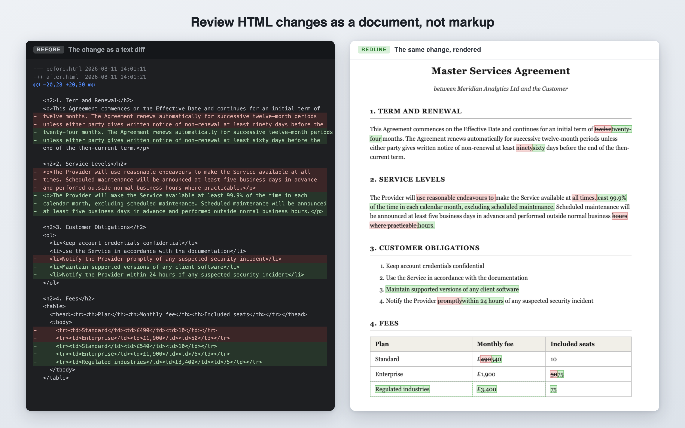

# Redline — Rendered HTML and Markdown Diff for IntelliJ

[](https://github.com/Bigsy/redline/actions/workflows/build.yml)
[](LICENSE)

https://plugins.jetbrains.com/plugin/33487-redline--rendered-html-diff

Review HTML and Markdown changes as a **rendered document**. When both sides of a diff are
HTML or both are Markdown, Redline adds a viewer that shows the document with insertions
and deletions highlighted inline — the way legal and publishing workflows mark up drafts.



Prose edits buried in long hand-authored lines, renumbered lists, and table changes become
readable at a glance instead of a wall of rewrapped markup.

## Features

- **Rendered Markdown** — headings, paragraphs, emphasis, links, fenced code, blockquotes,
  lists, task lists, and tables, with a document stylesheet that follows the IDE's light/dark theme.
- **Inline redline rendering** — one merged document with `ins`/`del` styling: deletions
  struck through in red, insertions highlighted in green, in the document's own layout.
- **Works anywhere the IDE shows a diff** — Compare Files, Local Changes, commits, and
  VCS revision history. Select **Redline** in the diff editor's viewer switcher, next to
  Side-by-side and Unified.
- **Change navigation** — previous/next change actions in the toolbar plus a minimap strip
  that marks every change block in the document, a "3 / 12" counter, and the current block
  outlined where it sits in the page.
- **Original / Redline / Final** — three views of the same merged document: the version you
  started from, the marked-up comparison, or the version you would end with. Keys `1`/`2`/`3`.
- **Find in document** — Cmd/Ctrl+F searches the rendered document, with match counts and
  match-case. Matches are found across the redline's own markup, so a phrase you can read is
  found even where an edit splits it in the HTML.
- **Live refresh** — edit the file in the editor and the redline follows, without losing your
  scroll position.
- **Swap Sides** — flip which revision counts as "before" without leaving the viewer.
- **Untrusted-by-design rendering** — reviewed documents run in a sandboxed JCEF pane:
  scripts never execute, external subresources are blocked by a strict CSP, `meta refresh`
  is stripped, and `javascript:` links are dead. Diffing a document can't phone home.

## Installation

Requires an IntelliJ Platform IDE **2024.1 or newer** with JCEF available (bundled in all
JetBrains IDEs; on 2026.2+ it lives in the bundled *Web Browser (JCEF)* plugin, which
Redline picks up automatically).

Install from inside the IDE: **Settings → Plugins → Marketplace**, search for
**Redline**, and click *Install*. (Or open the
[Marketplace listing](https://plugins.jetbrains.com/plugin/33487-redline--rendered-html-diff)
and use *Install to IDE*.)

**From source.** To run an unreleased build, build the zip yourself:

```
./gradlew buildPlugin
```

then **Settings → Plugins → ⚙ → Install Plugin from Disk…** and pick the zip from
`build/distributions/`.

## Try it

```
./gradlew runIde --args="diff testdata/demo/before.html testdata/demo/after.html"
```

opens the sandbox IDE directly on a contract-style demo diff in the Redline viewer.

For Markdown, use the included prose, table, task-list, and code demo:

```
./gradlew runIde --args="diff testdata/markdown/before.md testdata/markdown/after.md"
```

Select **Redline** in the diff viewer switcher. You can also select two Markdown files and
choose **Compare Files**, or open a Markdown diff from **Local Changes** or revision history.
Recognized extensions are `.md`, `.markdown`, `.mdown`, `.mkd`, and `.mkdn` (case insensitive).
Added/deleted files work with an empty opposite side; HTML/Markdown mixed comparisons use
the IDE's text viewers. No separate Markdown IDE plugin is required.

Leading YAML (`---`) and TOML (`+++`) frontmatter is displayed separately as escaped metadata,
preserving indentation. An unclosed frontmatter fence displays the remaining source as labelled
unterminated metadata. Metadata edits receive inline highlights. Changed code fences appear as
complete before/after blocks, with a code-specific explanation in the viewer.
Code fences preserve whitespace and scroll horizontally; syntax highlighting,
Mermaid diagrams, math rendering, and editing/merge controls are outside this viewer's scope.
Raw HTML passes through the same sanitization and sandbox policy as HTML diffs. Remote images,
styles, and other remote resources remain blocked. Rendered comparison can hide source-only
changes (such as equivalent Markdown syntax); use the text diff when that distinction matters.
See the [demo screenshots and verification notes](docs/markdown/README.md).

## How it works

Redline registers a `FrameDiffTool` that appears in the diff viewer switcher when both
sides of the request have the same supported format and JCEF is available (or one side is
empty for an added/deleted file). The Kotlin side serves the viewer
shell and both documents over a custom scheme handler; the shell (a Vite + TypeScript app
in `frontend/`, bundled into `src/main/resources/web/` at build time) computes the merged
redline with [redline-engine 0.2.0](https://www.npmjs.com/package/redline-engine) (MIT) and renders
it into a sandboxed iframe.

Markdown revisions are first converted to HTML by the bundled
[Marked](https://github.com/markedjs/marked) GFM renderer in a cancellable worker, then sanitized
and passed through the same whole-body comparison and projection checks as HTML. No renderer
or resource is downloaded at runtime. Revision filenames are detected from diff metadata when
no live file is available.

Each complete sanitized body pair is compared once in a Web Worker. The host permits 2,000,000
combined input UTF-16 units and 2,000,000 merged output units, with a 15-second watchdog and Cancel
button. Limits, unavailable workers and unsupported projections show an explicit fallback to the
new version; no synchronous or legacy retry can freeze the pane.
Markdown source and converted HTML are size-checked as well. If conversion itself fails, is
cancelled, or exceeds a limit, Redline shows an explanation directing you to the text diff;
it never attempts to render raw Markdown as HTML.

Original and Final are actual DOM projections of the merge, including formatting, attributes,
list items and table structure. All modes use the after document's head and base policy, so
Original is not a pixel-faithful reconstruction of the original stylesheet. The host independently
checks both body projections. Whole-region replacements get an explanation when finer comparison
is unavailable; Markdown code-block replacements have their own notice.
Head changes and hidden content retain their own explanations.

When a side of the diff is a live document, edits to it are pushed into the open session and the
shell re-renders in place — no page reload, so your scroll position survives.

Find is shell-side rather than JCEF's native find: matches are located by walking the document's
text and painted with the CSS Custom Highlight API, which marks text without touching the DOM.
That works wherever keyboard focus happens to be, and gives match counts, which the platform's
JCEF build cannot.

## Development

```
./gradlew check          # Kotlin/platform tests (builds and tests the frontend first)
./gradlew runIde         # sandbox IDE for manual testing

cd frontend
pnpm run test            # viewer unit tests (happy-dom)
pnpm exec playwright install chromium
pnpm run test:e2e        # sandbox-enforcement proofs in real Chromium
```

Release history is in [CHANGELOG.md](CHANGELOG.md).

### Releasing

Change notes live only in `CHANGELOG.md`; the build renders the section matching
`pluginVersion` into the plugin descriptor, so `plugin.xml` carries none.

For a one-click patch release, open **Actions → Release → Run workflow** on `main`.
The workflow increments the patch version, moves the Unreleased changelog entries into a dated
release section (or adds a maintenance note if empty), then commits and pushes the version and tag.
It explicitly starts the existing **build** workflow on that tag: publication still waits for
Kotlin/frontend checks, browser tests, and the plugin verifier. The Release run only prepares and
queues the release; follow the **build** run for the final publishing result. Only committed work
on remote `main` is included.

Configure the four repository secrets listed below before running Release. The workflow checks
that they exist before changing anything. Repository rules must allow `GITHUB_TOKEN` to push the
release commit and tag to `main`. If dispatch fails after the tag was pushed, rerun **build** with
that tag (`gh workflow run build.yml --ref vx.y.z`); do not prepare another patch release. An already
published Marketplace version cannot be uploaded again.

For a manually chosen version, release using a tag:

1. Bump `pluginVersion` in `gradle.properties`.
2. In `CHANGELOG.md`, rename `## [Unreleased]` to `## [x.y.z] — YYYY-MM-DD`, add a fresh empty
   `## [Unreleased]` above it, and update the compare links at the bottom.
3. Commit, then `git tag vx.y.z && git push origin main vx.y.z`.

The `publish` job in `.github/workflows/build.yml` then runs after the checks, e2e and plugin
verifier pass: it refuses a tag that does not match `pluginVersion`, fails if `CHANGELOG.md` has
no section for that version, signs the zip, creates a GitHub Release with the notes and the
signed zip attached, and publishes to the JetBrains Marketplace. It needs four repository
secrets: `CERTIFICATE_CHAIN`, `PRIVATE_KEY`, `PRIVATE_KEY_PASSWORD` (plugin signing) and
`PUBLISH_TOKEN` (Marketplace). To preview the notes locally:

```
./gradlew getChangelog --project-version=x.y.z --no-header --console=plain -q
```

## License

[MIT](LICENSE)
